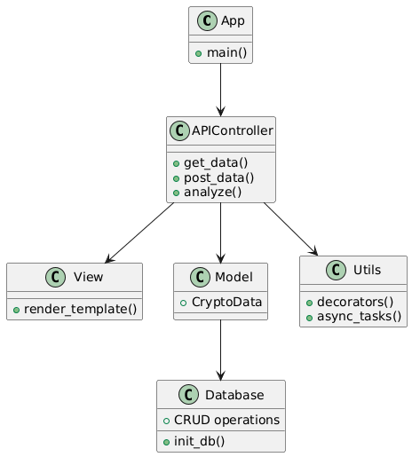

## Описание проекта
Это веб-приложение для анализа криптовалютных данных. Оно получает цены на криптовалюты из внешнего API (CoinGecko), хранит их в базе данных, предоставляет API для запросов, отображает данные через шаблоны и строит графики визуализации. Тема: анализ финансовых данных (криптовалюта). Данные: реальные цены из API, обработанные с Pandas.

Проект реализован на Python с использованием FastAPI, SQLAlchemy, Pandas и Plotly. Архитектура: MVC (Models - SQLAlchemy модели, Views - Jinja шаблоны, Controllers - FastAPI маршруты) с элементами MVVM для обработки данных во ViewModel-подобных утилитах.

## UML-диаграмма архитектуры

Описание: Диаграмма показывает взаимодействие между App (FastAPI), Controller (маршруты), Model (SQLAlchemy), View (Jinja) и Database (SQLite). Учтены паттерны MVC/MVVM для структурированного кода.

## Установка и запуск
1. `pip install -r requirements.txt`
2. `uvicorn main:app --reload` (сервер на http://127.0.0.1:8000)

## Примеры эндпоинтов
- GET /crypto/price/bitcoin — Получить цену Bitcoin.
- POST /crypto/add — Добавить данные (body: {"coin": "bitcoin", "price": 60000}).
- GET /crypto/view/bitcoin — Просмотр через шаблон.
- GET /crypto/analyze/bitcoin — Анализ и график.
- GET /demo-multitask — Демонстрация многозадачности.

## Тестирование
Запусти `pytest`.

## В РФ может потребоваться vpn для работы

Автор: Марьяновский Владислав Андреевич
